# WallCalToDo

A wall-mounted display (old monitor + Raspberry Pi) that shows your calendars
and a Microsoft To Do list at the same time. Calendars can come from Google
and/or Microsoft, and the to-do list is Microsoft To Do — one Microsoft
account can supply both halves. Works mounted either
way — portrait puts the calendar on top with today's agenda and the to-do
list below it; landscape puts the calendar on the left with today's agenda
and to-do stacked in a column beside it. It picks whichever automatically
based on the screen's own aspect ratio, no configuration needed.

<p align="center">
  
</p>

Below: the same display in both orientations and themes (click any of
these to see it fullscreen).

<p align="center">
  <a href="docs/demo-landscape-light.png">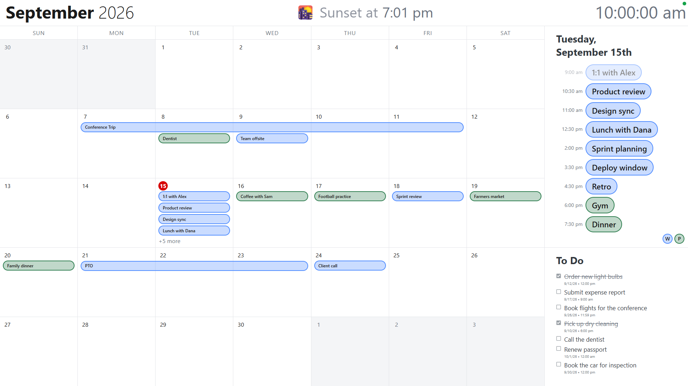</a>
  <a href="docs/demo-landscape-dark.png">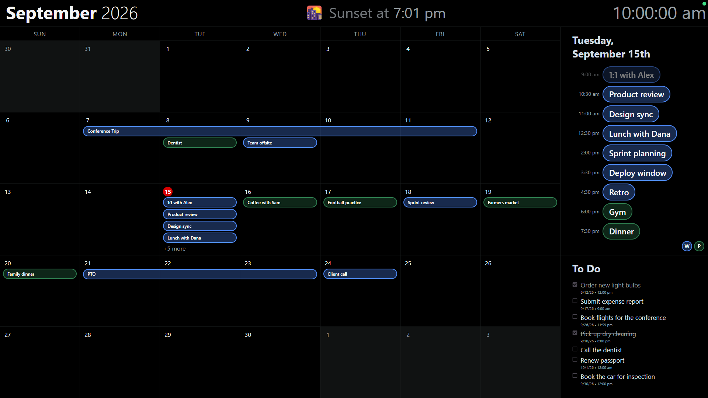</a>
</p>
<p align="center">
  <a href="docs/demo-portrait-light.png">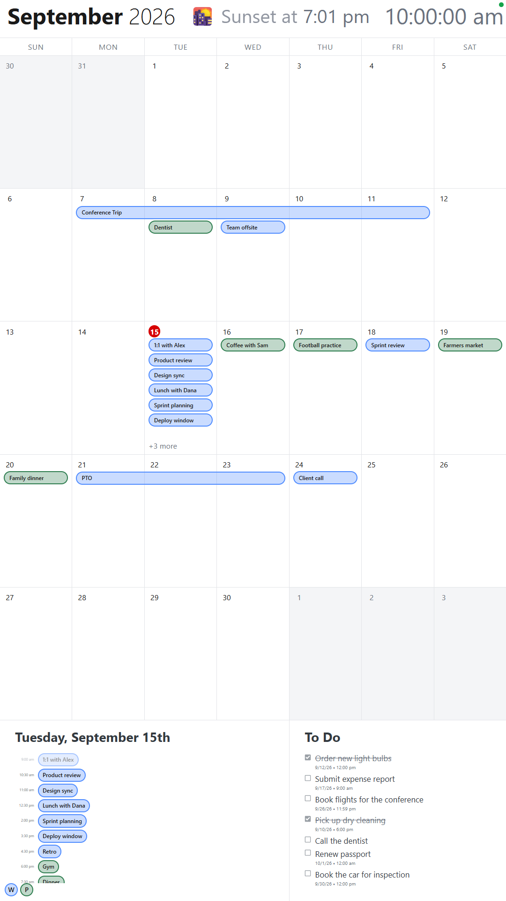</a>
  <a href="docs/demo-portrait-dark.png">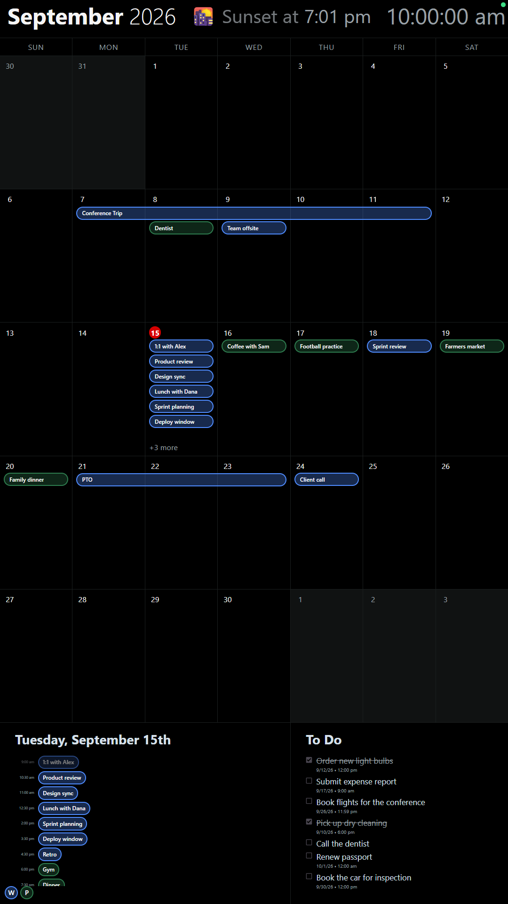</a>
</p>

*(The four screenshots above use demo data, not a real calendar — shown
with a lot going on to demonstrate multi-day events, the "+N more"
overflow on a busy day, and a mix of completed/pending to-do items with
due dates. A location is set, which is what puts the next sunrise or sunset
in the header.)*

## Why this exists

The point of this project isn't a new to-do app — it's to get a wall
calendar without giving up the one I already have. My actual calendar and
to-do list live in the stock Android apps: Calendar (backed by a
Google/Gmail account) and Microsoft To Do (backed by my Microsoft
account, which is what "To Do" runs on under the hood). That's genuinely
how I organize my life day to day, and I didn't want a wall display that
meant switching to yet another app just so it had something to show.

So instead of inventing its own data model, WallCalToDo reads straight from
the same accounts my phone already syncs against — the Google Calendar API
and the Microsoft Graph calendar and To Do APIs. Anything
I add, check off, or move on my phone shows up on the wall (see "How it
works" below for the polling delay), because it's the exact same underlying
data, not a copy of it. The wall display itself is read-only, though —
there's no touch input, so it's a one-way mirror of what's on my phone,
not something you edit from.

The to-do side runs on Microsoft To Do because that's the app I actually
use: it's a proper Android app, and its public Graph API is what the wall
reads. I linked my Microsoft account in the To Do app's settings, made it
the home of my to-do list, and moved the real list over to it — so To Do
on my phone and the to-do side of this wall display are now reading the
same Microsoft-backed list, the same way Calendar on my phone and the
calendar on the wall are reading the same Google account.

The only one-time cost is connecting your Google account to the Calendar
app and your Microsoft account to the To Do app if you haven't already —
after that, nothing about how you actually use your phone changes. The wall
display is just another window onto accounts you're already keeping up with.

## How it works

```
Google Calendar API (N accounts)   ─┐
                                    ├─ poll on interval (delta/sync tokens) ─ Node backend ─┬─ WebSocket ─ React kiosk app (Chromium fullscreen, portrait)
Microsoft Graph API                ─┘                                                       └─ REST ────── React companion app (your phone, same Wi-Fi)
```

- **server/** — Node/Express backend. Handles OAuth for any number of
  Google accounts plus one Microsoft account, polls each calendar on an
  interval using delta/sync tokens (cheap, only fetches what changed),
  polls the outside temperature separately on its own longer interval,
  and pushes updates to connected displays over a WebSocket. Also exposes
  the settings API the companion app uses. Serves both built frontends
  too, so the Pi only runs one process in production.
- **frontend/** — React kiosk app that renders the calendar, today's
  agenda, and the to-do list in one screen, laid out for portrait or
  landscape automatically (see "Screen orientation" below). Base colors/
  spacing/type scale live in `frontend/src/styles/tokens.css`; the actual
  visual design (event pill styling, the calendar grid, multi-day event
  bars, etc.) is in `frontend/src/styles/base.css` and the component files
  themselves.
- **companion/** — React settings app for your phone: connect/disconnect
  Google and Microsoft accounts, toggle individual calendars/lists on or
  off, and configure theme, location, temperature units, and privacy mode.
  Reachable at `http://<pi-hostname>:3000/companion` over your home Wi-Fi —
  see "Companion app" below.
- **pi-setup/** — systemd unit for the backend + kiosk Chromium autostart,
  plus the OS-level display rotation needed for a portrait mount (see
  "Screen orientation" below — landscape needs none of that).

## Auto-update behavior

There's no manual refresh step. The backend polls Google calendars, Microsoft
calendars, and Microsoft To Do every `POLL_INTERVAL_MS` (default 60s, see
`server/.env`) — Google and To Do ask "what changed since last time?" using
**sync tokens**, which is cheap enough to poll frequently if you want faster
updates (e.g. drop it to 15–20s). Microsoft is the exception and runs on its
own slower interval, for the reason given under
[Microsoft calendar fetching](#microsoft-calendar-fetching).

When a poll detects a change, the backend immediately pushes the new data
to every connected display over its WebSocket connection
(`server/src/ws/hub.js`) — so adding an event or a to-do item shows up on
the wall within one poll interval, with no page reload. A newly connecting
or reconnecting display (e.g. after a reboot) gets the full current state
the instant it connects.

True instant push (Google/Microsoft calling *us* the moment something
changes) would need a webhook subscription reachable from the internet,
which means a public HTTPS endpoint — not practical for a Pi sitting
behind home NAT. Polling with delta/sync tokens gets you effectively the
same result (updates within seconds to a minute) without that
infrastructure.

## The clock

The wall's own clock — top right of the calendar, and carried over to the same
corner when the weather view takes the screen — runs to seconds, `10:04:37 am`.
Seconds are what make a clock on a wall read as *running* rather than stuck;
without them, a display that redraws a few times a minute looks broken between
redraws.

It ticks once a second, and that's the only thing on the display that does.
The clock is its own component (`WallClock.jsx`) with its own timer rather than
a time read off whichever view happens to be up, because both views that show
one keep a clock of their own for unrelated reasons — the header for the
month and year, the weather view to trim the forecast to the next 24 hours —
and a shared tick would mean redrawing 34 forecast columns sixty times a minute
to redraw a string. Isolated, a tick costs one `<span>`.

Every *other* time on the display is deliberately left at minutes — an
agenda entry, an event pill, the hour-by-hour forecast, the sunrise and sunset
in the header. A meeting doesn't start at 10:30:47, and a sunrise isn't known
to the second anyway; seconds there would be false precision, not information.

## Screen orientation

The layout adapts automatically to whichever way the screen is actually
mounted — a CSS `orientation: landscape` media query (`frontend/src/
styles/base.css`), not a setting anywhere, so it responds instantly to the
screen's real aspect ratio, including a live browser resize during
development.

- **Portrait**: calendar on top, today's agenda and the to-do list in a
  strip below it, split side by side.
- **Landscape**: calendar on the left, today's agenda and the to-do list
  stacked in a column on the right — the agenda gets more of that column's
  height than the to-do list, and the line between them is snapped to one
  of the calendar's own row lines rather than an arbitrary split.

Both use the same 19:5 proportion between the calendar and the today/to-do
area (as rows in portrait, as columns in landscape) — proportional `fr`
units throughout, not fixed pixel values, so this works at whatever
resolution your display actually is, not just the exact one it was
designed against.

Portrait needs the Pi's display output physically rotated to match how
the monitor is mounted (the *browser* just needs to think of the screen as
narrow-and-tall) — landscape needs no rotation at all, since that's a
monitor's native orientation. Rotate at the OS level, not in the browser,
only if you want portrait:

- **Bookworm (Wayland/labwc)**: `wlr-randr --output <output> --transform 90`
  (use `270` if 90 comes out upside down for your mount), run once to test,
  then add it to `~/.config/labwc/autostart` above the kiosk launch line.
  `wlr-randr` lists your output name.
- **Bullseye and earlier (X11)**: add `xrandr --output <output> --rotate left`
  (or `right`) to the autostart script before Chromium launches. `xrandr`
  (no args) lists your output name.

If the monitor is on an HDMI-to-something adapter that doesn't like
software rotation, some HDMI/DSI displays also support rotation via
`/boot/firmware/config.txt` (`display_rotate` or `video=` framebuffer
params) — check your specific display's docs if `wlr-randr`/`xrandr`
doesn't take effect.

## Sunrise and sunset in the header

The header carries the day's next sun event between the month/year and the
clock — `🌅 Sunrise at 7:09 am`, `🌇 Sunset at 7:01 pm` — in muted text a step
below the clock's own size, since the month/year and the clock are the two
things the header exists to show and this sits under both. One event rather
than both, because which one matters depends on the hour: at 3pm "sunrise 7:09
am" is something that already happened, and at 8pm "sunset 7:01 pm" likewise.
What you want off a wall is when it next gets light or dark, which is always
exactly one of them. So the row shows whichever is still ahead — today's
sunrise before it, today's sunset in between, and after sunset, **tomorrow's**
sunrise, which is why the backend sends tomorrow's pair as well as today's.
Showing today's sunrise at 9pm would be an hour-old event presented as a
future one.

The whole point of a wall display is knowing whether it's still light outside
without walking to a window, and after dark the question becomes when it will
get light again.

These are the *same* times the Automatic theme already switches on, not a
second calculation. The backend works them out from the saved location with the
public-domain sunrise equation (`server/src/services/sunService.js`, accurate
to a minute or two — no API call, so nothing about this needs the Pi to reach
a sunrise service), hands them over with every settings push, and the display
prints them. What the wall says therefore cannot drift from what the display
is actually doing, which is the failure a separate calculation would eventually
have.

Nothing is shown until a location is set in the companion app, and every one of
the four times can come back missing — no location, or a latitude where the
sun neither rises nor sets — in which case the row is simply absent rather than
showing a time that isn't going to happen. If **Advanced** is on in the theme
settings, today's times are the shifted ones the display is actually acting on
rather than the raw astronomical ones; tomorrow's never are, since nothing
today decides anything about tomorrow.

The row updates itself as the day goes, on its own half-minute clock, rather
than waiting for the once-a-day settings push: which event is next changes *at*
sunrise and sunset, and a display nobody is looking after can't be told the
boundary passed by an update that arrives on its own schedule.

## Microsoft calendar fetching

Microsoft Graph needs a few things spelled out that Google Calendar's API
doesn't, so the two providers are handled separately all the way through
(Google in `calendarService.js`, Microsoft in `msCalendarService.js`).

- **It polls on its own slower interval** (10 minutes, against the 60s default
  for everything else), because a round re-reads each calendar's whole window
  rather than asking what changed — see the point below.
- **It reads `calendarView`, not `calendarView/delta`.** The delta variant
  answers with a restricted property set: in one measured round, 1146 of 1488
  events came back with no `subject` at all, and it doesn't reliably expand
  recurring series, so whole weeks of recurring meetings were simply absent.
  The plain endpoint returns complete events and expands recurrences, the same
  thing Google's `singleEvents: true` gives on the other side. The cost is
  re-reading the whole window each round, which is what the slower interval
  pays for — and, as a bonus, there's no delta token to expire.
- **Events are filtered the same way Google's are** — cancelled, draft, and
  explicitly-declined events don't show; tentative and unanswered invitations
  do, because Outlook lists those dimmed rather than hiding them.
- **Each day is capped at two events** — and for today, the two are the ones
  still to come. A work calendar carries far more per day than a wall has room
  for, and the overflow is invisible: the day cells measure themselves and trim
  to "+N more", so a heavy day quietly becomes a month of "+N more" badges that
  say nothing about what's actually on. Capping at the display's own capacity
  keeps the days that still fit saying what they always did, and stops the
  ones that don't from pretending to.

  Picking the *next* two rather than the day's first two is the part that
  matters on a wall nobody is standing in front of: at 3pm the 9am meeting
  happened hours ago, and spending both slots on the morning leaves the wall
  saying nothing at all about the rest of the day. A day with one event left
  shows that one rather than padding the slot back up; a day that's entirely
  behind us falls back to its first two, so it isn't blank. Past and future
  days keep the first two, which is all there is to say about them.

  The two are chosen in the same order the day cell would have rendered them
  (all-day first, then by start time) — otherwise the cap would drop the event
  that was going to be shown and keep the one that was about to be trimmed. A
  meeting in progress still counts, since it's the one you may be walking to; a
  multi-day trip counts on every day it crosses, and an event that loses its
  place on one day is dropped whole rather than left showing on the days where
  it did fit. Google's calendars are untouched, and the cap is applied when the
  list is read, not when it's cached, so nothing is lost: the cache on disk
  stays complete and today's agenda and the to-do list are unaffected.

  Because "the next two" is relative to the current time, the display's feed
  is no longer a pure function of what the providers hold — on a quiet day the
  list a display *should* be showing changes as the morning's meetings pass,
  with no poll reporting anything. The poller therefore pushes the calendar
  when the list itself differs from the one already sent, rather than only
  when a provider says something changed.

## Calendar legend and outside temperature

Two small widgets round out the wall display, both pinned to a bottom
corner of their panel:

- **Calendar legend** (bottom-left of the agenda panel; mirrored onto the
  same panel's bottom-right in landscape) — one letter-circle
  per calendar, in its own color, so a glance at a pill tells you which
  calendar it's from. If a calendar has events with a per-event color
  override (Google Calendar's "change color of this event"), those colors
  stack behind the main circle as plain swatches. Ordered to match the
  order calendars appear in the companion app — Google accounts first, then
  the Microsoft account's — not alphabetically. Two calendars from different
  providers can share a name ("Work" in both Google and Microsoft); they're
  still separate circles, told apart by color.
- **Outside temperature** (bottom-right of the to-do panel) — current
  temperature plus a weather emoji, from [Open-Meteo](https://open-meteo.com/)
  (free, no API key), refreshed every 15 minutes. Switches to a moon-phase
  emoji (all 8 phases) once the sun sets, using the same sunrise/sunset
  times driving Automatic theme, and swaps in a 😷 mask instead of the
  weather icon when the local air quality is unhealthy (wildfire smoke,
  etc. — EPA US AQI ≥ 151). Needs a location set in the companion app
  (Location section) to show anything at all; which units it prints in is a
  toggle in that same app's Units section, alongside wind speed and
  precipitation.

## Weather view

The display can hand the whole screen over to a weather view for a while and
then give the calendar back — the next **24 hours** broken out hour by hour
across the top, the next **10 days** broken out day by day underneath, and
today's conditions, wind and clock across the top. How often that happens is
set in the companion app (**Weather view**): an interval — off, every 15
minutes, half an hour, hourly, 2, 3 or 6 hours — and how long each appearance
lasts, from 30 seconds to 5 minutes. Off is the default, since it's a change
to what the wall shows between the calendar and something else.

The window is measured against the clock rather than counted down by a timer,
which is what makes it work on a display nobody is looking after: no state to
keep, nothing to drift, and a display that restarts mid-window lands back in
the right place instead of skipping its turn or starting a fresh one. Two
displays on the same network agree without talking to each other. With an
hourly setting the weather appears *on* the hour, every hour, which is
predictable enough to wait for.

The handover itself is a transition in both directions: the outgoing view fades
out over half a second, and the incoming one fades up over as much again,
passing through the background colour in between rather than through the
other view. Both are dense grids of text, and dissolving one into the other
would leave every row of both legible at once, which from across a room reads
as a glitch. Sequential also means only one view is ever mounted, and no frame
of the display is spent rendering the calendar grid and 34 forecast columns at
the same time. On the way back it reads as the display blinking rather than
switching; on the way out the weather's own intro starts as it fades up, so the
number is counting as the view arrives. A swap that gets called off partway —
the reading briefly arriving empty, say — leaves the wall settled on the view it
already had, rather than half-faded.

Each appearance opens with a short intro: the current temperature counts the
rest of the way up to its real value while the sky icon scales in and the two
strips slide up behind it, a little over a second in total. It plays every
time rather than once a session, since the view mounts afresh each time the
rotation brings it back and each appearance is meant to be worth a look — the
default minute on screen has to stay mostly readable, so it's kept short. The
count starts a fixed interval below the real reading rather than at zero, which
would be a lie about a warm day and would count from the wrong end of the scale
below freezing. Anyone who has asked their system to reduce motion gets the
value straight away, with the rest of the intro stood down to match.

A 24-hour strip is bound by its own width, not its height — 24 columns across
a portrait panel is about 45px each — so the view is one centred column
rather than two panels each claiming half the screen, and the leftover space
becomes equal margin above and below instead of a strip marooned in hundreds
of pixels of black. Landscape has little of that space to spare, so the same
rule reads as the two-panel split it was meant to be. The clock comes along
even though the view replaces the whole display: a wall that stops telling
the time once an hour is a worse wall.

One forecast fetch covers all of it. The hourly series is fetched a day deeper
than the view uses (48 hours, displayed as 24) because the cache only
refreshes every 15 minutes, so a view that asked for exactly its own window
would start short whenever the reading underneath it was more than an hour
old; the extra depth costs about 2KB and means the strip is never short of
hours however stale the cache is.

Needs a location set in the companion app, like the temperature widget — with
no location the view never takes over, rather than replacing the calendar
with an empty screen.

<p align="center">
  <a href="docs/demo-weather-landscape-dark.png">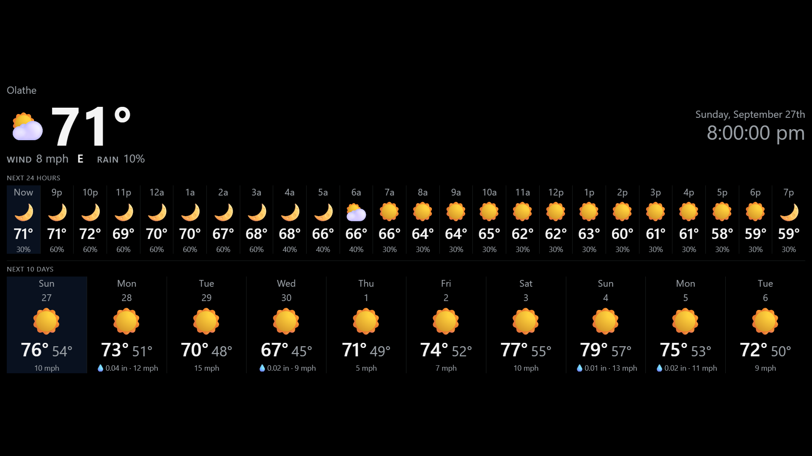</a>
  <a href="docs/demo-weather-landscape-light.png">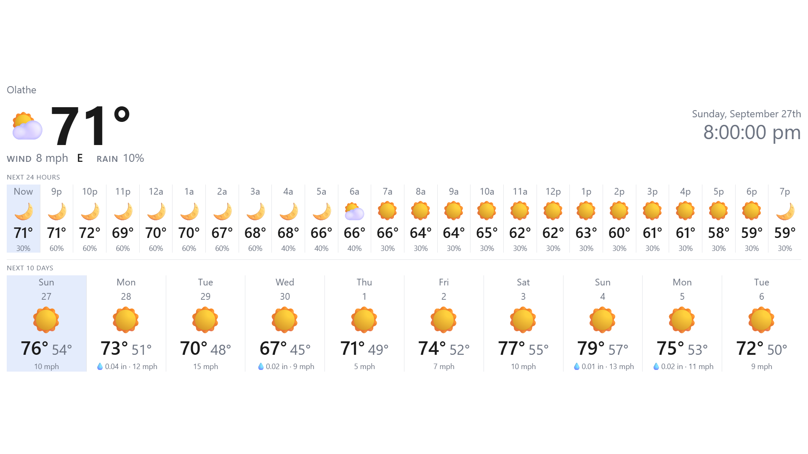</a>
</p>
<p align="center">
  <a href="docs/demo-weather-portrait-dark.png">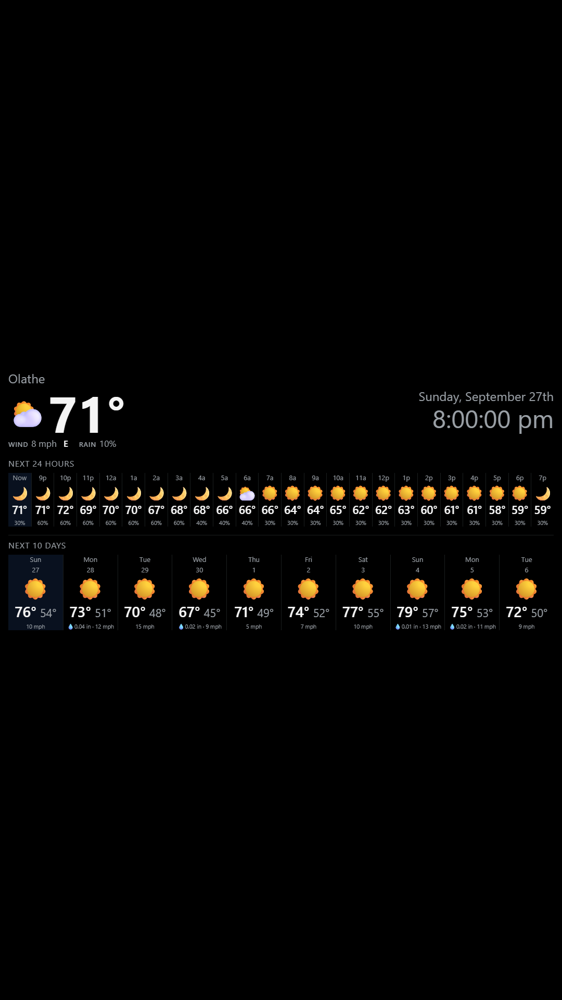</a>
  <a href="docs/demo-weather-portrait-light.png">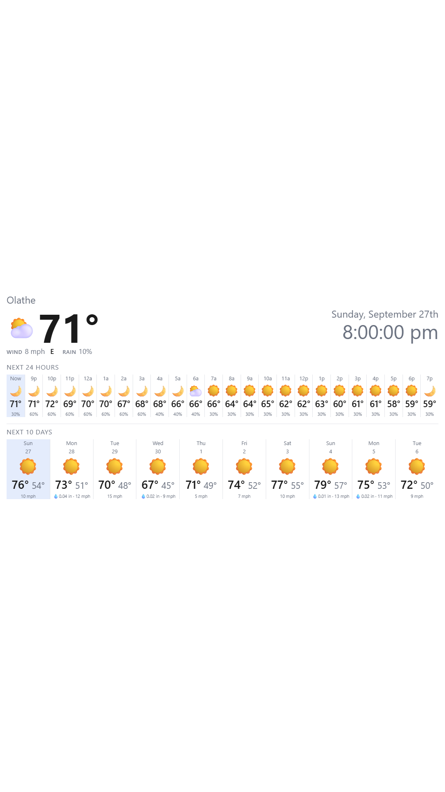</a>
</p>

*(Unlike the calendar captures above, the forecast in these is real rather
than invented: an actual [Open-Meteo](https://open-meteo.com/) reading for
Olathe, Kansas, frozen the moment it was fetched, with the clock pinned to
the hour that reading was taken in so the column marked "Now" really is now
(Sunday 27 September, 8:00 pm). The left pair is in US units and the right
pair metric, which is the Units section doing its job. No calendar is visible
in any of them because the view replaces the display outright — the clock
stays, though, since a wall that stops telling the time once an hour is a
worse wall. Rendered through a throwaway harness that pinned the clock
inside the rotation's window and fed the frontend canned data in place of the
WebSocket feed, not committed, same as the fixture behind the calendar
captures.)*

## Holiday decoration

A day carrying one of fifteen holidays gets its day number circled in the
holiday calendar's own color — the same circle "today" gets, in that
calendar's color instead of the fixed red, so the holidays in a month pick
themselves out at a glance from across the room. The ring says *something* is
a holiday; the image beside the number says *which* one — beside the number
rather than in place of it, so the day still reads as a day. Each is the image
you'd reach for on a card for that holiday, deliberately the conventional
first choice rather than a second-best stand-in, since the point is that the
calendar names itself before anyone leans in to read a pill.

No dates are hardcoded anywhere. The holidays arrive as ordinary all-day
events from a holiday calendar — Google's "Holidays in United States" (under
**Other calendars → Browse calendars** in Google Calendar) or Microsoft's
equivalent, which carries the same name — and the display marks these fifteen
by name, each with the image it's conventionally drawn with: New Year's Day 🎉,
Martin Luther King Jr. Day ✊, Presidents' Day 🇺🇸, Memorial Day 🪻,
Juneteenth 🖤, Independence Day 🎆, Labor Day 🛠️, Columbus Day ⛵, Veterans Day
🎖️, Thanksgiving 🦃, Christmas Day 🎄, Halloween 🎃, Valentine's Day ❤️,
Easter 🐣, and St. Patrick's Day 🍀. The name matching is deliberately loose,
since the same holiday turns up as "Presidents' Day (Washington's Birthday)"
in some years and "Washington's Birthday" in others, Easter as "Easter
Sunday", and MLK Day as "Birthday of Martin Luther King, Jr." — a missing
marker is a worse outcome than a slightly liberal match.

So there's nothing to switch on: subscribe to that calendar and the markers
appear with its events. Switching it off in the companion app takes the
markers away too, since both come from the same events. Anything else that
calendar happens to list stays unmarked.

Privacy mode doesn't hide the markers, or the images beside them. They mark a
date rather than say what's on it, the same way the day numbers themselves
stay visible; only titles go.

<p align="center">
  <a href="docs/demo-holiday-landscape-dark.png">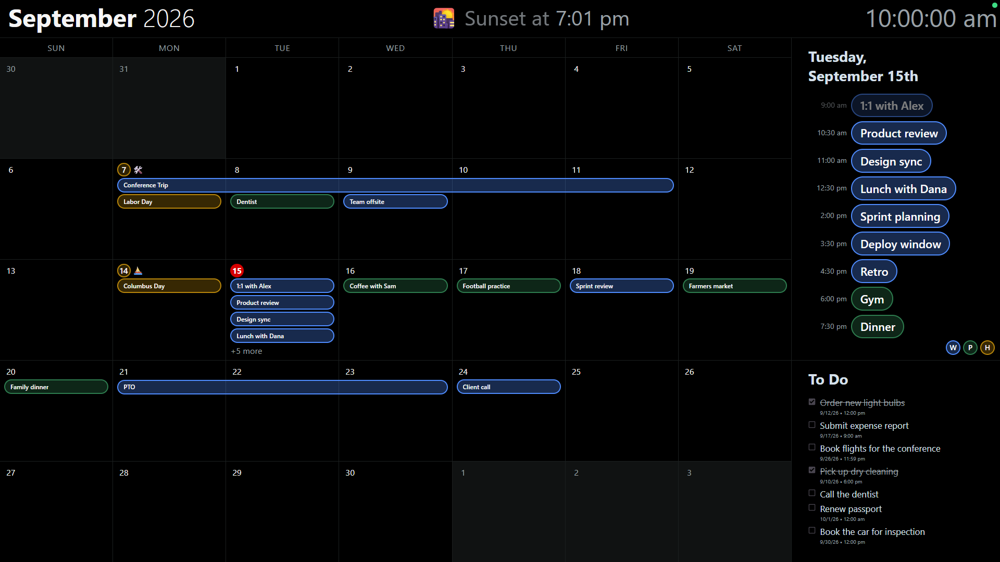</a>
  <a href="docs/demo-holiday-landscape-light.png">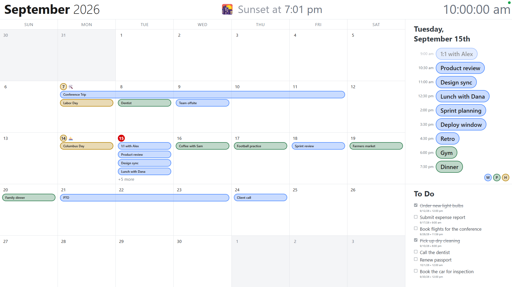</a>
</p>
<p align="center">
  <a href="docs/demo-holiday-portrait-dark.png">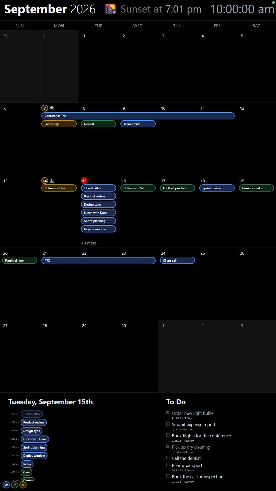</a>
  <a href="docs/demo-holiday-portrait-light.png">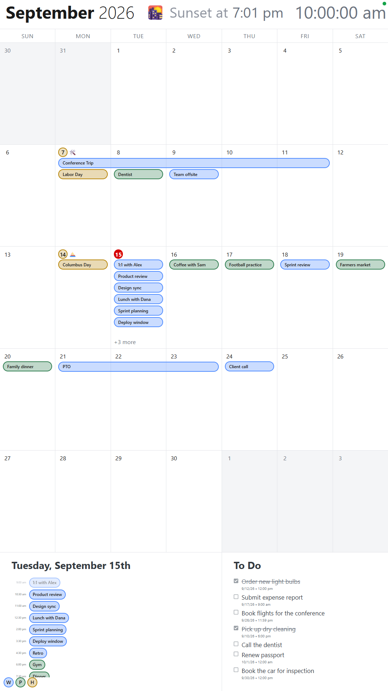</a>
</p>

*(Demo data again, like the four above, with a third calendar added carrying
the two US holidays that fall in September 2026. Labor Day on the 7th and
Columbus Day on the 14th are ringed in that calendar's own gold — the same gold
as their pills, and as the "H" in the legend — with the image each holiday is
conventionally represented by sitting beside the number, at the number's own
size. The 15th is today, in the fixed red it always uses.)*


A separate small app (`companion/`) served at `/companion` lets you manage
everything from your phone or laptop, on the same Wi-Fi as the Pi:

- **API credentials** — each of the Google Calendar and Microsoft
  sections has its own Client ID/Client Secret form, with a "Where do I
  get this?" panel that walks through creating your own free API
  credentials in that provider's console. No terminal/`.env` editing
  required (see the setup guide's step 7 below for screenshots) — this is
  the one thing about each provider that only needs to be entered once.
  The Microsoft one also has an optional Tenant ID field, which scopes
  sign-in to a single Entra directory and can be left blank (the default)
  to accept any Microsoft account. Its app registration needs **two**
  delegated Microsoft Graph permissions — `Tasks.Read` for the to-do lists
  and `Calendars.Read` for the calendars — since one account supplies both
  halves (see setup step 7).
- **Add a Google account** — tapping the button starts the normal Google
  OAuth flow; you can connect as many Google accounts as you want (e.g.
  personal + work). Reconnecting an account you've already added updates
  its tokens instead of creating a duplicate.
- **Toggle calendars on/off** — each connected account lists every
  calendar the provider returns for it (not just the primary one). Flipping
  a switch hides or shows that calendar's events on the wall display
  immediately — no polling delay, since filtering happens at read time
  against calendars already cached. Note this means "hide *this calendar*",
  not "silence this person": when someone shares a calendar with you and then
  invites you to a meeting, that meeting lands in *your* calendar as a
  separate copy, so it stays on the wall after you switch off their shared
  calendar. That's deliberate — those are meetings you're meant to attend.
  Hiding them by organizer as well was tried and reverted: it made no
  measurable difference, because the meetings worth hiding live in *your*
  calendar, not the shared one.
- **Birthdays get a cake** — a contacts-derived birthday is marked with 🎂 on
  its pill, and in today's agenda, so the one day of the year that's about
  someone rather than about a meeting is legible at a glance. Google flags
  these with an `eventType` rather than anything in the title, which is what
  makes it reliable: an event someone called "Birthday party" is a party,
  and the same contact's own birthday says whatever the calendar's language
  says. Microsoft can't do this — its `event` resource has no birthday field
  at all, and Outlook's birthday "calendar" is a view over contacts rather
  than real events, so there is nothing for the API to hand over. The cake is
  a sibling of the title rather than part of it, so it survives a title
  truncated to three lines in a narrow cell; and it goes away in privacy mode
  along with the title it decorates.
- **Birthdays are already on the wall** — there is no Birthdays calendar to
  subscribe to, and none to go looking for in the list above. Google builds
  birthdays from your Google Contacts and hands them to the API as ordinary
  all-day events on your own calendars, tagged `eventType: "birthday"`. Apart
  from the cake above they need nothing special: they appear under whichever
  calendar they arrived on, in that calendar's color, like any other
  all-day event. The Birthdays calendar you can see in the Google Calendar UI
  is a *separate* thing, and it
  is not merely absent from the API's calendar listing — it's unreadable
  outright. With a valid `calendar.readonly` token, both `calendarList.get`
  and `events.list` on its well-known id (`contacts#group.v.calendar.google.com`)
  return 404, while the same calls on any listed calendar return 200. An
  earlier version added that calendar anyway, by asking for the id and falling
  back to probing whether events could be read from it; on a real account that
  path can never fire, so it has been reverted rather than left behind as a
  promise this document would have to keep making.

<p align="center">
  <a href="docs/demo-birthday-landscape-dark.png">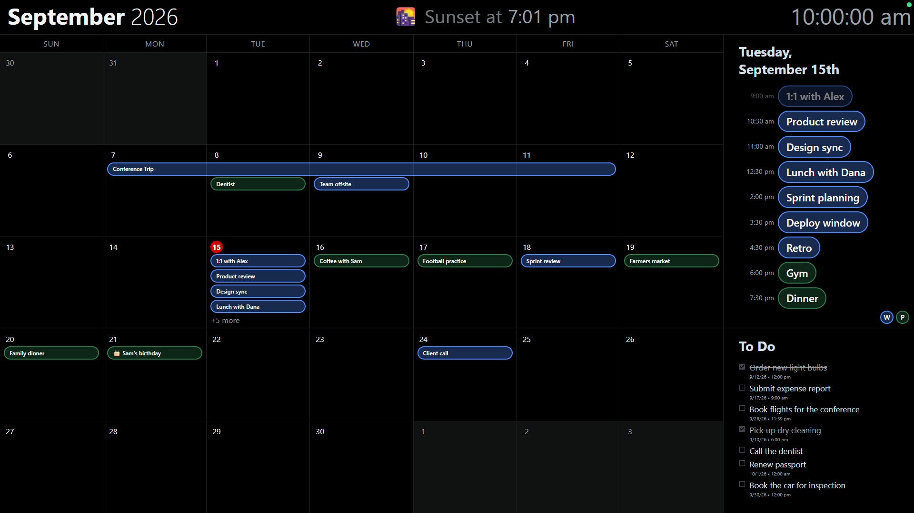</a>
  <a href="docs/demo-birthday-landscape-light.png">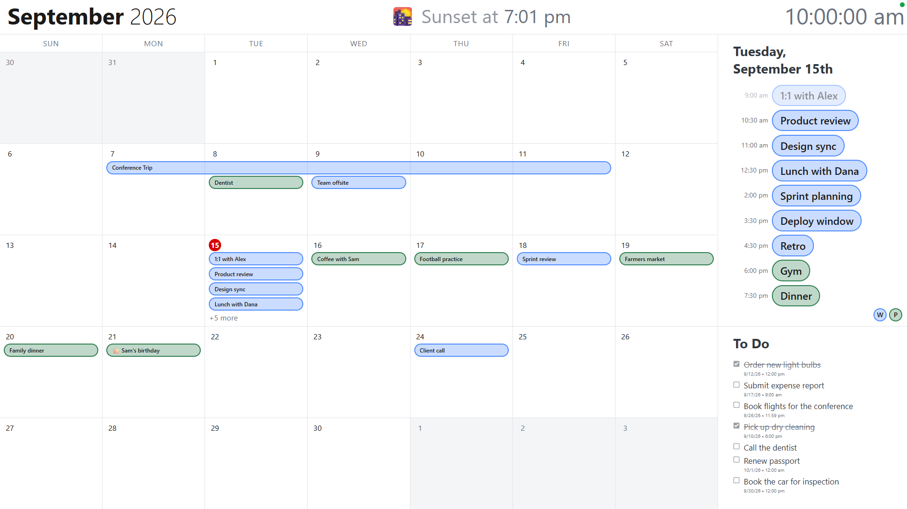</a>
</p>
<p align="center">
  <a href="docs/demo-birthday-portrait-dark.png">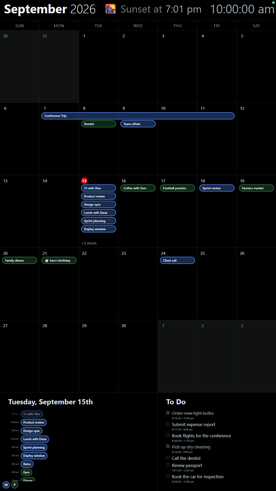</a>
  <a href="docs/demo-birthday-portrait-light.png">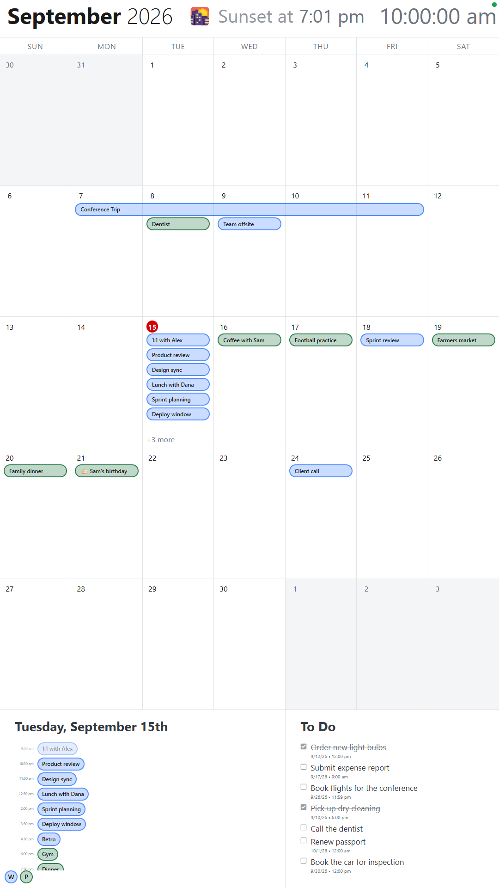</a>
</p>

*(Demo data again, with the clock moved to 8 November so a Family-calendar
birthday is today's: Dana on the 3rd, Alex's on the 8th — in the agenda, with
a cake beside its pill — and Jordan on the 20th. The Birthdays calendar itself
is unreadable over the API, as above, so these stand in for the ordinary
all-day events Google really hands over, tagged the same way.)*

- **Untitled events are shown** — an event with no title at all (Graph's
  `subject`, Google's `summary`) displays as "(No title)" on both providers
  rather than being hidden. This reverses an earlier version of this doc that
  dropped them, and the reason is worth keeping: an event only lacks a subject
  if the provider failed to send one, so hiding them silently deleted real
  events whenever a field went missing. Microsoft's `calendarView/delta` did
  exactly that — 1146 of 1488 events in one round came back with no `subject`,
  the filter removed every one, and the wall looked nearly empty for reasons
  nothing on screen could reveal. See
  [Microsoft calendar fetching](#microsoft-calendar-fetching) for the
  provider-side fix. A genuinely untitled entry — a focus-time block, an
  Outlook placeholder — now stays visible, and setting
  `LOG_MS_CALENDAR_ROUNDS=1` in `server/.env` (off by default, so the journal
  isn't written to every poll for no reason) makes `journalctl` report an
  untitled count if that number ever climbs.
- **Disconnect a Google account** — removes it and its cached events
  entirely.
- **Refresh calendars** — neither provider notifies us when you create a new
  calendar, so this button re-fetches an account's calendar list on
  demand (new calendars default to enabled).
- **Connect a Microsoft account** — one account at a time, supplying *both*
  the calendars and the to-do lists from the single sign-in. Discovers
  every calendar it can read (including ones shared with you) and every To
  Do list, each with its own on/off toggle. Completed tasks are cleared out
  automatically once a week (the first poll after midnight on a Monday) to
  keep the list from accumulating crossed-off items forever — this only
  trims what the wall display shows, it never touches the real task in
  Microsoft To Do, so un-completing or editing one afterward brings it
  right back. Microsoft calendar events are filtered the same way Google
  ones are, and each day is capped at two of them — see
  [Microsoft calendar fetching](#microsoft-calendar-fetching) for why, and for
  the polling difference behind it. Since Graph has no per-event colors, a
  Microsoft calendar's own color is all its pills get.
- **Reconnect for calendars** — an account connected before this read
  Microsoft calendars has a token that was never consented to
  `Calendars.Read`, so its to-do lists work but its calendars can't be
  fetched. The companion app says so and offers a Reconnect link; the next
  sign-in is the one that grants the extra permission. Nothing breaks in
  the meantime.
- **Privacy mode** — a single toggle that hides event titles (only their
  colored pills stay visible) and replaces today's agenda and the to-do
  list with a placeholder notice on the wall display, for whenever you'd
  rather not have the contents visible at a glance.
- **Location** — set once by **searching for a city** (backed by
  OpenStreetMap's free Nominatim geocoder,
  `server/src/services/geocodeService.js` — this one part does need
  internet access), shared by both Automatic theme and the outside
  temperature widget. "Use my location" is also there as a zero-typing
  shortcut when it's available, but browser geolocation needs a secure
  context, so it only shows up when the companion app is opened on the
  Pi's own screen — searching for a city works from anywhere, including
  your phone.
- **Theme** — a Light/Dark/Automatic segmented control. Automatic switches
  the wall display between light and dark at sunrise/sunset for the
  location above (computed locally, `server/src/services/sunService.js` —
  no API call needed for this part). Once a location is set, an Advanced
  toggle reveals a Sunrise row and a Sunset row that each let you shift the
  actual switch time by 15/30/45 min or 1/2/3 hours, Before or After the
  real sun event (e.g. Sunset + 30 min "After" so it doesn't go dark right
  at sunset) — the displayed time on each row is already offset-adjusted,
  i.e. the moment the switch actually happens.
- **Units** — one section for the three things the wall measures:
  **temperature** (°F/°C), **wind speed** (mph/km/h/m/s/knots) and
  **precipitation** (inches/millimetres), the latter two feeding the [weather
  view](#weather-view) as well as the corner temperature widget. All three
  are disabled with an explanatory notice until a location is set, since every
  reading comes from that location. Defaults are the US ones throughout
  (°F, mph, inches).
- **Weather view** — how often the full-screen forecast takes over the
  display, and for how long; see [Weather view](#weather-view). The interval
  is timed from the clock, not from when you turned it on, so an hourly
  setting appears on the hour.

Every change here pushes to the wall display immediately over the same
WebSocket connection used for calendar/to-do updates — no refresh needed
on either end.

This intentionally does *not* have a login/passcode — it trusts your home
network, same as the rest of this setup. It's also **not reachable from
outside your Wi-Fi** by design; if you want to tweak settings while out of
the house, put something like Tailscale on the Pi rather than exposing it
publicly. The one exception to "the whole app trusts your home network" is
the account connect flow, which is limited to the Pi's own screen plus any
networks you explicitly list — see the next section.

### Connecting an account from a remote computer

The one thing the companion app deliberately won't do from just anywhere is
connect a new account. Both providers only allow a plain-`http://` redirect
URI for the literal loopback address, so the leg that comes back from
Google/Microsoft's consent screen carrying the code only reaches the Pi if the
browser doing it can resolve `localhost:3000` to the Pi itself — i.e. from
the Pi's own screen. From any other device it looks like it's working right up
through the provider's own consent screen, then silently fails on the way
back, which is why the buttons are hidden rather than left to fail confusingly.

That's the default: loopback only, nothing to configure, and the rest of the
companion app (toggling calendars, disconnecting an account, changing
settings) stays open to your home network as described above. Everyday use
from your phone works exactly as before.

If you'd rather not walk over to the Pi to add an account, list the networks
you trust in `server/.env`:

```
TRUSTED_CIDRS=192.168.1.0/24
```

and restart the backend (`sudo systemctl restart wallcaltodo`). The server
checks the address each request came in on, so this is a real gate rather than
something the app guesses at from its own hostname: the OAuth callback is
refused as well as the button that starts the flow (it's the callback that
actually exchanges a code for a token, so gating only the button would be
worthless), and a refused request comes back to the companion app with a
message saying which address it was seen as and what to do about it. Entries
can be single addresses or ranges, IPv4 or IPv6, comma-separated —
`192.168.1.42,10.0.0.0/8,fd00::/8` — the Pi's own loopback is always allowed
without being listed, and an entry that doesn't parse (a stray `/33`, a typo
in an address) is named in `journalctl` at startup instead of quietly leaving
you locked out of your own account connects.

Listing a network says "these computers may start an account connect". It
doesn't change where the provider sends the browser back to, so that half
still needs one of:

- **A port forward**, which is what the
  `ssh -L 3000:localhost:3000 pi@wallcaltodo.local` line under "Managing it
  later" is for. Open `http://localhost:3000/companion` in the remote
  computer's browser through that tunnel and `localhost` *is* the Pi, so the
  registered redirect URI works untouched and no Google/Microsoft setting
  changes at all. The forwarded request arrives from that computer's real
  address, which is why its network needs to be in `TRUSTED_CIDRS` too.
- **A real redirect URI**, if you'd rather not hold a tunnel open (a phone,
  mostly): set `GOOGLE_REDIRECT_URI`/`MS_REDIRECT_URI` in `server/.env` to an
  HTTPS address that reaches the Pi, register that same address with the
  provider, and list the phone's/computer's network in `TRUSTED_CIDRS`. Both
  providers refuse plain `http://` for anything but loopback, so this needs
  TLS in front of the Pi — a reverse proxy on it, or Tailscale, or similar.
  The credentials walkthrough in the companion app shows whichever URI is
  actually configured, so it stays accurate either way.

## Hardware notes

**Use a Pi 4 if you have one.** It has more RAM and a faster CPU than
older Pis, which matters because Chromium itself is the heaviest thing
running here — the Node backend is tiny by comparison (tens of MB of RAM).
A Pi 3B (1GB RAM) can run this, but with less headroom: stick to
Raspberry Pi OS Lite + a minimal kiosk compositor rather than the full
desktop if that's what you're using, and avoid heavy CSS effects
(blurs, constant animation) in the eventual design. Bandwidth and storage
are non-issues either way — this app's data is tiny JSON, not media.

One cable gotcha: the Pi 4 uses **micro-HDMI**, not full-size HDMI like
the Pi 3. Check what your monitor cable needs before you buy an adapter.

## Setup guide

Step-by-step, assuming no prior experience with any of this. It walks
through everything: flashing the SD card, installing the software,
connecting your accounts, and mounting it on the wall.

### What you'll need

- A Raspberry Pi (4 recommended — see "Hardware notes" above) with a
  power supply and a microSD card (16GB+; a card marked "A1" or "A2"
  boots noticeably faster than an unrated one)
- A monitor with an HDMI input, plus the right cable: the Pi 4 has a
  **micro-HDMI** port, older Pis have full-size HDMI
- A laptop/desktop computer, just to flash the SD card
- A Google account (for the calendar) and, if you want the to-do list, a
  Microsoft account with Tasks/To Do items
- The Pi and your phone/computer all on the same home Wi-Fi network

### 1. Flash the SD card

1. On your computer, install
   [Raspberry Pi Imager](https://www.raspberrypi.com/software/).
2. Insert the microSD card, open Imager.
3. **Choose OS** → Raspberry Pi OS (64-bit) — the full version with a
   desktop, not "Lite". Kiosk mode needs a desktop environment to run
   Chromium in.
4. **Choose Storage** → your SD card.
5. Before writing, click the gear/settings icon (**OS customisation**) and set:
   - **Hostname** — pick something memorable, e.g. `wallcaltodo` (you'll
     use `wallcaltodo.local` to reach it later).
   - **Username/password** — this guide uses `pi` throughout; if you pick
     something else, swap it in every command below, in the server's unit
     file `pi-setup/wallcaltodo.service` (it sets `User=pi` and
     `/home/pi/...` paths), and in the `/home/pi` paths under
     `pi-setup/kiosk/`.
   - **Wi-Fi** — your network name and password, so it connects on first boot.
   - **Enable SSH** — with password authentication.
6. Write the image, wait for it to finish, then eject the card.

### 2. First boot

1. Put the SD card in the Pi, connect the monitor and power. Wait a
   minute or two for the first boot to finish.
2. From your computer, open a terminal and SSH in:
   ```
   ssh pi@wallcaltodo.local
   ```
   (Use the hostname you set in step 1. Accept the fingerprint prompt,
   enter the password you set.)

### 3. Update the OS and install Node.js

Run on the Pi (over the SSH session):

```
sudo apt update && sudo apt full-upgrade -y
curl -fsSL https://deb.nodesource.com/setup_20.x | sudo -E bash -
sudo apt install -y nodejs git fonts-noto-color-emoji
node -v   # should print v20.x — if it doesn't, something above failed
```

`fonts-noto-color-emoji` isn't always preinstalled on Raspberry Pi
OS — without it, an emoji in an event title (from Google Calendar) shows up
on the display as a blank box instead of the actual emoji. If you're seeing
that on a Pi set up before this was added, just run that one `apt install`
line and restart the kiosk (`sudo systemctl restart wallcaltodo` doesn't
touch Chromium — reboot, or re-run `kiosk.sh`, to pick up the new font).

### 4. Get the code onto the Pi

```
git clone https://github.com/smccloud/WallCalToDo.git
cd WallCalToDo
cp server/.env.example server/.env
```

That's it for `.env` — it only holds things like the port and poll
interval now, plus the optional `TRUSTED_CIDRS` list of networks allowed to
connect an account remotely (see "Connecting an account from a remote
computer" above; not needed for a from-scratch setup). Your Google/Microsoft
credentials get entered through the companion app itself in step 7 below,
not by hand-editing a file.

### 5. Install dependencies and build both apps

```
cd ~/WallCalToDo/server && npm install
cd ~/WallCalToDo/frontend && npm install && npm run build
cd ~/WallCalToDo/companion && npm install && npm run build
```

This takes a few minutes on a Pi — that's normal.

The two `npm run build` steps are what actually produce what the display and
the companion app serve; the backend picks both up from those directories
(`server/src/index.js`). Nothing rebuilds them on its own later, so they have
to be re-run after every `git pull` — see "Managing it later" below.

### 6. Run the backend as a background service

```
sudo cp ~/WallCalToDo/pi-setup/wallcaltodo.service /etc/systemd/system/
sudo systemctl daemon-reload
sudo systemctl enable --now wallcaltodo
sudo systemctl status wallcaltodo
```

The status output should say **active (running)**. If it doesn't, run
`sudo journalctl -u wallcaltodo -n 50` to see why.

The `daemon-reload` in the middle isn't optional: systemd keeps its own
cached copy of the unit files it has already read, and `cp`-ing one in by
hand doesn't update that cache. Without the reload, `enable --now` can act
on a stale or missing definition — most visibly, editing this unit to fix a
path and re-running these commands appears to change nothing at all. The
reload is only needed when the unit file itself changes; normal
`sudo systemctl restart wallcaltodo` after editing settings doesn't need it.

The unit sets `LogLevelMax=notice`, which is what keeps a restart from
printing systemd's own "Starting…/Stopped…/Consumed…" lines — those are
info-level and the backend has nothing to say at boot. Anything that
actually went wrong still appears in `journalctl -u wallcaltodo`. (It
needs systemd 240+, which is any Pi OS from Bullseye on; on something
older, delete that line or the unit won't start at all.)

### 7. Connect your accounts

Do this step on the Pi's own screen (i.e. with a keyboard/mouse on the
monitor connected to the Pi, in its normal desktop — not kiosk mode yet,
and not from your phone). This is required because the redirect URLs each
provider needs are `localhost`-only, which only means something to a
browser running on the Pi itself. If you'd rather not walk over to the Pi,
see "Connecting an account from a remote computer" above — it's the same
steps, just with your computer's network added to `TRUSTED_CIDRS` and the
provider's redirect getting back to the Pi through a port forward.

1. Open the Pi's Chromium (Menu → Internet → Chromium) and go to:
   ```
   http://localhost:3000/companion
   ```
2. Scroll to **Google Calendar**. Click **Where do I get this?** to
   expand the steps for creating your own free Google API credentials —
   it walks you through the Google Cloud Console and tells you exactly
   what to paste in:

   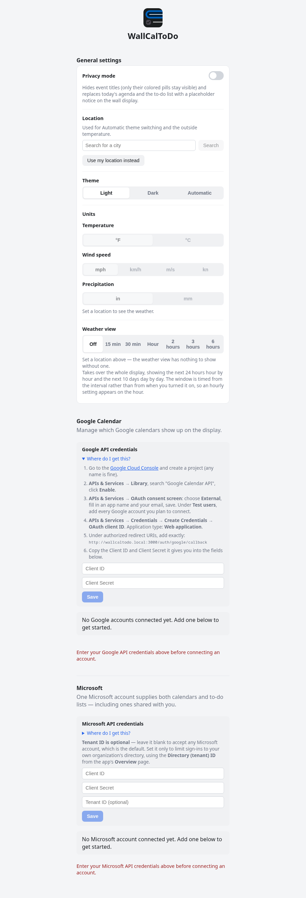

   Paste the **Client ID** and **Client Secret** it gives you into the two
   fields and click **Save**.
3. The section now shows **Configured**, and a **+ Add Google account**
   button appears. Tap it, sign in, grant access. Repeat for every Google
   account you want on the display. Each connected account shows its
   calendars with a toggle for each one:

   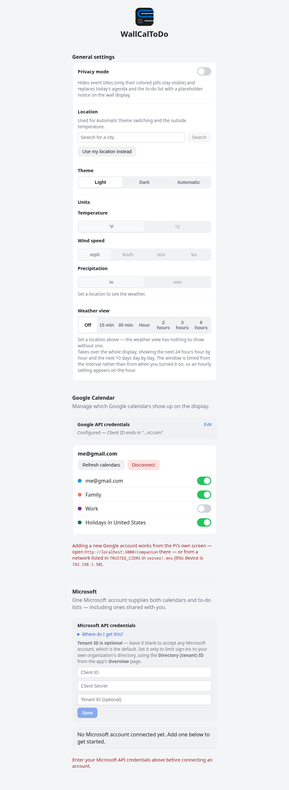

4. Scroll to **Microsoft** and do the same thing — expand **Where do I get
   this?**, follow the Azure Portal steps, paste in the Client ID/Secret it
   gives you, Save:

   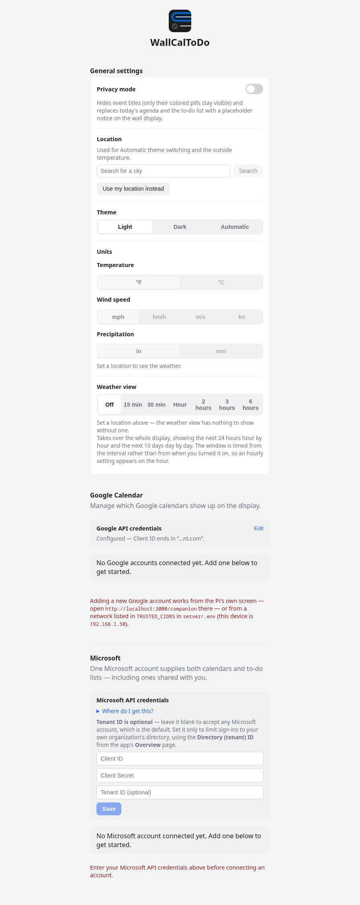

   The permissions step in that panel asks for **two** delegated Graph
   permissions, not one — both are required, and both come from the same
   sign-in, since one Microsoft account supplies both halves:
   - **`Tasks.Read`** — the to-do lists.
   - **`Calendars.Read`** — the calendars.

   Add both under **API permissions → Add a permission → Microsoft Graph →
   Delegated permissions**. Doing this in the portal is a prerequisite, not
   an optional extra: an app registration that only lists `Tasks.Read`
   cannot ask the user for `Calendars.Read` at sign-in, so a connection
   attempt against one fails with a consent error instead of connecting.

   There's also an optional **Tenant ID** field, which most people can leave
   blank: it decides which Entra directory the sign-in page points at, and
   the default accepts any Microsoft account (a personal Microsoft account
   has no directory of its own to point at). Only fill it in if you want
   sign-ins restricted to your own organization's directory, using the
   **Directory (tenant) ID** from the app's **Overview** page.

5. Tap **+ Connect Microsoft account** and sign in. The account then shows
   its calendars and its to-do lists, each with its own toggle.

   **Upgrading from a version that only did to-do lists?** That version's
   instructions only asked for `Tasks.Read`, so an existing account has two
   things to fix: add `Calendars.Read` to the app registration as above,
   *then* reconnect the account. The reconnect is what carries the new
   permission — the old sign-in can't be widened without a new one. Until
   both are done, the companion app's Microsoft section says the calendars
   can't be read yet and offers a **Reconnect** link. The to-do lists keep
   working throughout, so nothing is lost in the meantime.

If anything about a connection attempt fails (wrong secret, an account
that isn't added as a Google test user yet, etc.), the companion app shows
the reason in a banner at the top of the page instead of a blank/broken
screen — fix whatever it says and try again.

Then check `http://localhost:3000` in that same browser — you should see
your real events/tasks. If it's empty, give it a minute (it polls every
60 seconds by default) and check `sudo journalctl -u wallcaltodo -f`.

<sub>Prefer editing a file over a web form? `server/.env` still accepts
`GOOGLE_CLIENT_ID`/`GOOGLE_CLIENT_SECRET`/`MS_CLIENT_ID`/`MS_CLIENT_SECRET`
(as well as the optional `MS_TENANT_ID`) as a fallback — whatever's saved
through the companion app just takes priority over them.</sub>

### 8. Enable kiosk mode (and rotate the display, if mounting in portrait)

Follow **`pi-setup/kiosk/README.md`** — it covers setting Chromium to
auto-launch full-screen on boot, plus rotating the display if you're
mounting in portrait (skip that part for landscape — see "Screen
orientation" above), depending on your Pi OS version.

Then reboot:

```
sudo reboot
```

The Pi should come back up straight into the full-screen display.

### 9. Mount it

Physically attach the monitor to the Pi and mount both on the wall.
You're done — from here on, changes to your calendars show up
automatically (see "Auto-update behavior" above).

### Managing it later

**To update to a newer version of this project**, `git pull` on its own is
*not* enough. Both frontends are served as built output (`frontend/dist` and
`companion/dist`), and those directories are gitignored, so a pull updates the
source and leaves the files the display is actually running untouched — which
shows up as a feature that "didn't take", with the old version still on the
wall. After pulling, rebuild both and restart the backend:

```
cd ~/WallCalToDo && git pull
cd ~/WallCalToDo/frontend && npm install && npm run build
cd ~/WallCalToDo/companion && npm install && npm run build
sudo systemctl restart wallcaltodo
```

Any change under `server/` needs only the restart; anything under `frontend/`
or `companion/` needs its rebuild, and the browser on the Pi is running
fullscreen with no page reload, so the restart (or a reboot) is what actually
puts it on screen. Skipping the rebuild is safe in the sense that nothing
breaks — you just keep running the version you had.

From your phone, on the same Wi-Fi, open
`http://wallcaltodo.local:3000/companion` (swap in your own hostname) to
toggle calendars or disconnect an account — this works fine from your
phone. **Adding a brand-new account** still has to come from a device
allowed to run that flow: the Pi's own screen, same as step 7, or one of the
networks in `TRUSTED_CIDRS` (see "Connecting an account from a remote
computer" above). Over SSH rather than walking over:

```
ssh -L 3000:localhost:3000 pi@wallcaltodo.local
```

then open `http://localhost:3000/companion` on your laptop through the
tunnel. Add your laptop's network to `TRUSTED_CIDRS` first (and restart the
backend) or the request will be turned away.

### Troubleshooting

- **Can't reach `wallcaltodo.local` from your phone** — not every network/
  device supports `.local` mDNS names. Find the Pi's IP instead: SSH in
  and run `hostname -I`, then use `http://<that-ip>:3000/companion`.
- **Backend won't start** — `sudo systemctl status wallcaltodo` and
  `sudo journalctl -u wallcaltodo -n 50` for the actual error.
- **Google/Microsoft connect fails** — the companion app shows the reason
  in a banner at the top of the page (wrong Client Secret, an account not
  added as a Google test user yet, a device that isn't allowed to connect an
  account, etc.) rather than leaving you guessing.
- **"Adding a new account" buttons missing, or a connect attempt bounced
  back with a banner** — that device isn't the Pi's own screen and its network
  isn't in `TRUSTED_CIDRS`, which is the intended default rather than a bug.
  Either open `http://localhost:3000/companion` on the Pi itself, or add the
  address the banner names (or its `/24`) to `TRUSTED_CIDRS` in `server/.env`
  and `sudo systemctl restart wallcaltodo`. If you added an entry and it's
  still refused, `sudo journalctl -u wallcaltodo -n 50` names any entry it
  couldn't use — that's the only thing this service logs about its network
  config, since a correct list has nothing to report.
- **A connect from a listed computer still fails after the consent screen** —
  the device got past the allowlist, so this is the redirect: it comes back
  to `http://localhost:3000/...`, which only reaches the Pi if that browser
  resolves `localhost` to it. Keep an SSH port forward open
  (`ssh -L 3000:localhost:3000 pi@wallcaltodo.local`) or register a real
  HTTPS redirect URI — see "Connecting an account from a remote computer".
- **A Microsoft account's to-do lists work but its calendars don't** — it was
  connected before `Calendars.Read` was requested, so its existing token
  only carries `Tasks.Read`. The companion app's Microsoft section says so
  and offers a **Reconnect** link. Reconnecting is necessary but not
  sufficient: an app registration that doesn't list `Calendars.Read` can't
  ask for it, so add it under **API permissions → Microsoft Graph →
  Delegated permissions** first, *then* reconnect. Do both in that order —
  a reconnect on its own fails with a consent error. See setup step 7.
- **Kiosk screen is blank or shows a desktop instead of the app** — SSH in
  and run `pi-setup/kiosk/kiosk.sh` by hand to see its output directly,
  and double check the autostart file syntax in `pi-setup/kiosk/README.md`.
- **You used a different username than `pi`** — update `User=` and the
  `/home/pi/...` paths in `pi-setup/wallcaltodo.service` before copying it
  to `/etc/systemd/system/`.

## Local development

For iterating on the code itself (not installing on the Pi), run each
piece on your own computer instead:

```
cd server && npm install && npm run dev
cd frontend && npm install && npm run dev
cd companion && npm install && npm run dev
```

The kiosk app lands on `http://localhost:5173`, the companion app on
whatever port Vite picks next (check its terminal output) — both proxy
`/api` and `/auth` calls to the backend on `:3000` (the kiosk app also
proxies `/ws`, since it's the one that needs the live WebSocket push; the
companion app doesn't use it). Since everything's on `localhost` here, the
OAuth connect step just works directly: open the companion app, enter your
Google/Microsoft API credentials in their respective sections (see step 7
of the setup guide above if you haven't created those yet), then use
**+ Add Google account** / **+ Connect Microsoft account**.

To preview the kiosk's portrait layout on a normal monitor, just shrink
the browser window narrow (taller than it is wide) — no special flag
needed. Widen it back out (wider than tall) to preview landscape instead.

## Design

The visual design lives directly in this repo now — `frontend/src/styles/
tokens.css` for the base color/spacing/type scale, `frontend/src/styles/
base.css` and the component files (`CalendarView.jsx`, `CalendarHeader.jsx`,
`SunTimes.jsx`, `WallClock.jsx`, `DayAgenda.jsx`, `TodoView.jsx`, `Legend.jsx`,
`WeatherWidget.jsx`,
`WeatherView.jsx`, `BirthdayMark.jsx`) for the
actual layout and styling. It's been iterated on in place rather than
built separately and dropped in: the calendar grid, event pill styling (a
stroke in the event's own color over a tinted background, not a solid
fill), multi-day event bars, the portrait/landscape split (proportional
`fr` units throughout, not fixed pixels, so it isn't tied to one specific
resolution), and a light/dark theme (`tokens.css` defines both palettes
behind a `data-theme` attribute App.jsx sets on `<html>`, driven by the
companion app's theme setting) were all designed and shipped this way. The
data layer (OAuth, polling, WebSocket push) is unaffected by any of it —
styling changes stay confined to the style files and component markup.

## Roadmap

**A second Microsoft account** — the calendar side already takes Google
(any number of accounts) and Microsoft, but Microsoft itself is still capped
at one account, because its to-do half has nowhere to disambiguate between
accounts. Lifting that means a second Microsoft identity on both sides.

**More to-do providers** — the to-do side is still Microsoft-only. Google
Tasks is the obvious candidate, given the calendar side already talks to
Google.

## Credits

Built with [opencode](https://opencode.ai) (the `big-pickle` model) for code
generation, refactoring, and debugging — most of the Microsoft calendar
support in particular was written this way, as was the fix for the
Calendars.Read consent check that was misreporting correctly-configured
accounts as unconfigured.

Attribution is also recorded in the commit history, via `Co-Authored-By`
trailers on the commits that used it. Note that GitHub's own Contributors
graph won't reflect those trailers, because it credits an email address only
when it's attached to a GitHub account, and the addresses these tools
publish for this purpose aren't. This section is the reliable record.

Everything is MIT-licensed and yours to do with as you like — the tooling
did the typing, the design decisions and the debugging of what it got wrong
were the human's.

